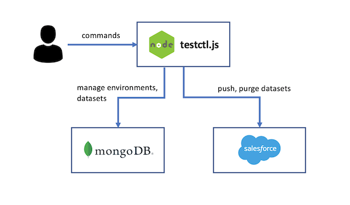

# testdata
Test data service - creates and manages test data sets for Salesforce applications.
Datasets consisting of a list of contacts can be randomly generated and saved to MongoDB.  The datasets can
be pushed to any configured Salesforce environment.




## Installation

start mongodb

```
 docker run -d -p 27017:27017 mongo
 ```

 install application

```
npm install
```

## Usage

Use the following syntax to run testctl commands from your terminal window:

```
node testctl.js  [command] [TYPE] [NAME] [flags]
```

where `command`, `TYPE`, `NAME`, and `flags` are:

* `command`: Specifies the operation that you want to perform on one or more resources, 
for example `create`, `get`, `describe`, `push`. `delete`

* `TYPE`:   Specifies the resource type. For example: `dataset`, `environment`

* `NAME`: Specifies the name of the resource. Names are case-sensitive. 
If the name is omitted, details for all resources are displayed, for example `testctl get dataset`.

* `flags`: Specifies optional flags. For example, you can use the -c or --count flags to specify the number of 
test data records to create.


## Create an environment

Copy the file `evironment.json.sample` to `environment.json` and fill in credentials for your salesforce environment.

For example:

```
{
    instance: 'https://na174.salesforce.com',
    client_id: '3MVG9LCJsApeX_PD3xIQFoGio_wU3QqhLi3wzUwbZbmvD6Ujv1nQUg1roWmUYZAF2Kq3joOi6IhxJSCmm5ydg',
    client_secret: 'D5286E3760C2675FEBDE7EA0684A046E19FAD318754ECF940B33007224C0EFC2',
    username: 'user@domain.com',
    password: 'zzzNxZ2R28TYZJzetbMKmHkfCiXVu0WnVagX0HDX6MRw6WkRX'
}
```

Import the environment, specifying name:

```
node testctl.js  create environment <NAME> -f ./environment.json
```

You should see output similar to:

```
Environment env1 created.
```

## Get list of environments

To list all configured environments, type:

```
node testctl.js  get environment
```

The output will be something like:

```
NAME       INSTANCE                      CLIENT_ID          USENAME
dktest     https://na174.salesforce.com  3MVG9LBJLApeX...   david@seattleweb.com
bro        https://na174.salesforce.com  3MVG9LBJLApeX...   foo@seattleweb.com
```

## Describe and environment

To see details of a saved environment, type:

```
node testctl.js describe environment <NAME>
```

You will see output as follows:

```
ENVIRONMENT   : env1
INSTANCE      : https://na174.salesforce.com
CLIENT_ID     : 3MVG9LBKLApeX_PD3xIQFoGip_wU3QqhLi3wyUwaZbmeD6UjvMnQUg1roWmUYZAF2Kq3jIO36IhxJSCmm5ydg
CLIENT_SECRET : D5196E3760C2675FEBDE7DA2684A046F19FAD318854ECF940B33007524C0EFC2
USERNAME      : user@slalom.com
PASSWORD      : zzzWxZ2Q28TZZJzetbMKnHkdCiXVu0WObagX0HDX6MRw6WkR3
```

## Create a new dataset

A new dataset can be created and saved to the database as follows:

```node testctl.js create dataset <NAME>
```

Output will be something like:

```
Saved 10 contacts for dataset test2 to database.
```

## Get a list of saved datasets

To list saved datasets:

```
node testctl.js get dataset
```

The saved datasets will be displayed

```
NAME
set2
set3
```

## Output a dataset

To see a dataset printed to console, type:

```
node testctl.js describe dataset set2
```

You should see the data:

```
NAME                 PHONE                  EMAIL
Dedrick Yundt        (329) 479-4990 x093    Mazie_Treutel5@hotmail.com
Corine Rogahn        451.852.3925 x866      Ashtyn_Waters62@yahoo.com
Gina Monahan         (580) 408-7464 x91367  Damon.OConnell@hotmail.com
Roma Rice            132-151-5192 x132      Dahlia.Kertzmann@yahoo.com
Savion Hessel        (863) 354-4453         Macie23@gmail.com
Clyde Mills          1-600-426-4880         Selena.Gislason@hotmail.com
Arianna McClure      014.830.7934 x0987     Isidro_Purdy8@yahoo.com
Adelle McDermott     1-226-534-8154         Lyda_Wyman@gmail.com
Lindsey Jakubowski   950-640-2457           Jerel57@hotmail.com
Elisha D'Amore       1-140-961-5579 x9874   Jerry90@yahoo.com
```


## Push dataset to environment

Once saved, the dataset can be pushed to a salesforce.  

```
node testctl.js push dataset <DATASET> <ENVIRONMENT>
```

The output will be:

```
Pushed 10 contacts from dataset test2 from datbase to salesforce env1.
```

## Purge data from an environment

To purge data from an environment, type:

```
node testctl.js purge environment <ENVIRONMENT>
```

You should see output like:

```
Environment test1 purged.
```

## Delete a dataset

The command to delete a dataset is:

```
node testctl.js delete dataset <NAME>
```

It will be confirmed by output:

```
Dataset set1 deleted.
```

## Delete an environment

The command to delete an environment is:

```
node testctl.js delete environment <NAME>
```

It will be confirmed by output:

```
Environment env1 deleted.
```
